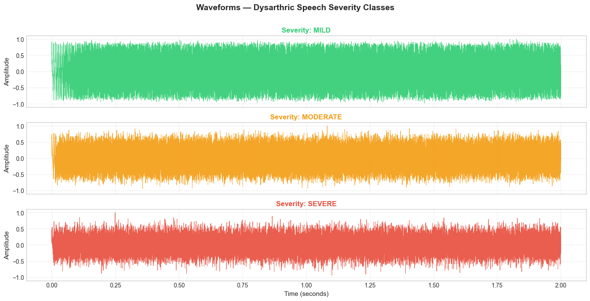
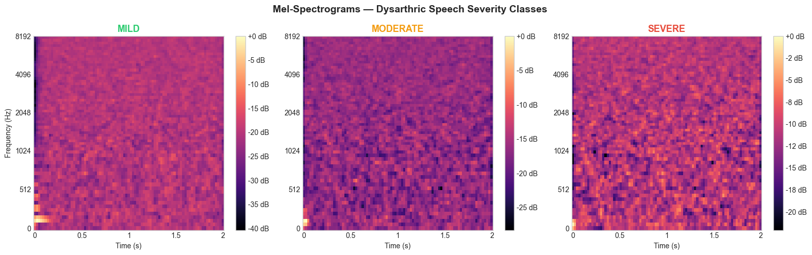

# Dysarthric Speech Severity Classification

> Classifying dysarthric speech as **Mild / Moderate / Severe** using acoustic features (MFCCs, ZCR, Spectral Centroid) and comparing SVM vs Random Forest classifiers.

---

## Overview

Dysarthria is a motor speech disorder caused by neurological conditions — cerebral palsy, ALS, Parkinson's disease — that weakens the muscles used for speech. Patients are clinically categorised by severity based on intelligibility and articulation control.

This project builds a **complete speech processing and classification pipeline** that:

- Generates synthetic speech samples with controllable dysarthric characteristics (jitter, shimmer, noise)
- Visualises audio as waveforms and Mel-spectrograms
- Extracts acoustic features: **13 MFCCs**, **Zero Crossing Rate**, and **Spectral Centroid**
- Trains and compares **SVM (RBF kernel)** and **Random Forest** classifiers
- Evaluates with 5-fold stratified cross-validation and confusion matrices
- Connects the pipeline to real dysarthric speech research (TORGO database, clinical literature)

---

## Visualizing the Audio Data

To understand the acoustic differences between severity classes, we analyze both the raw waveforms and the Mel-spectrograms. 

### Waveforms (Amplitude vs. Time)
*Notice the increase in amplitude variance and noise as severity increases.*


### Mel-Spectrograms (Frequency vs. Time)
*Harmonic structure becomes progressively degraded and less distinct in moderate and severe cases.*


---

## Pipeline

```text
Raw Audio (.wav)
      │
      ▼  librosa
Feature Extraction
  ├── MFCCs (13 coefficients) — vocal tract spectral envelope
  ├── Zero Crossing Rate      — voicing / breathiness
  └── Spectral Centroid       — pitch brightness proxy
      │
      ▼  scikit-learn
Classification
  ├── SVM (RBF kernel, C=10, gamma='scale')
  └── Random Forest (100 trees)
      │
      ▼
Evaluation
  ├── 5-Fold Stratified Cross-Validation
  ├── Hold-out Test Accuracy (30% split)
  └── Confusion Matrix + Classification Report
